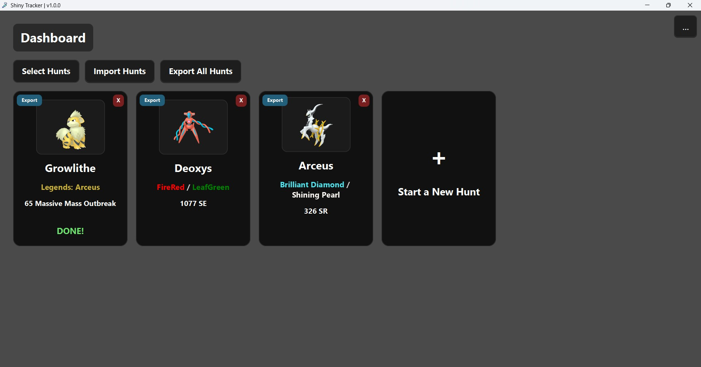
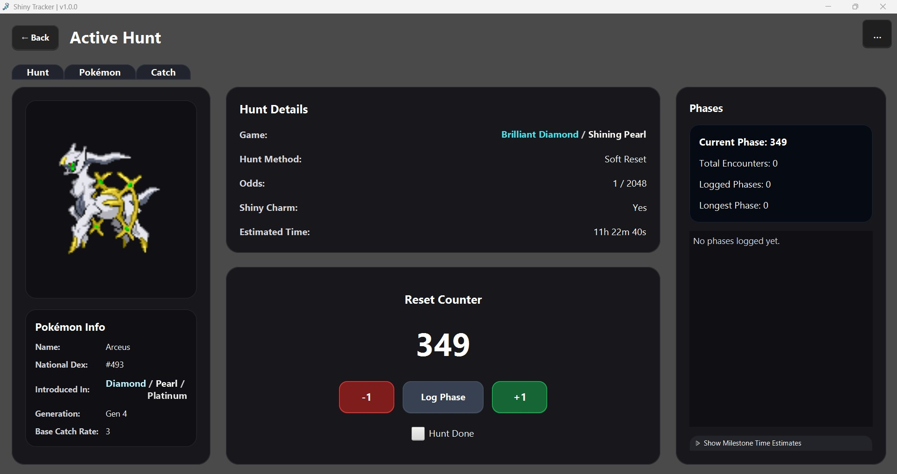
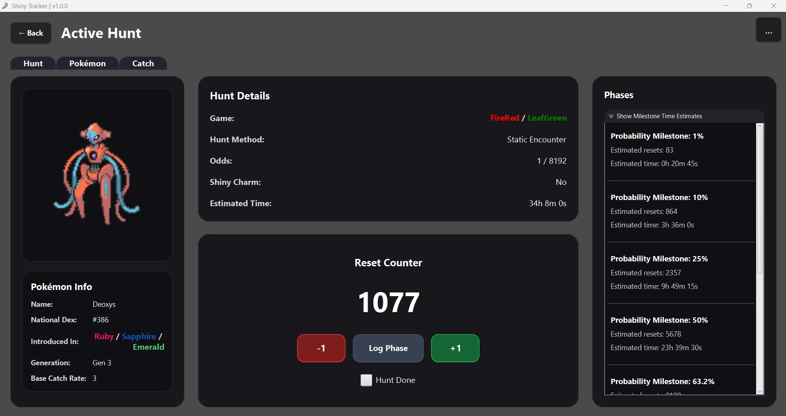
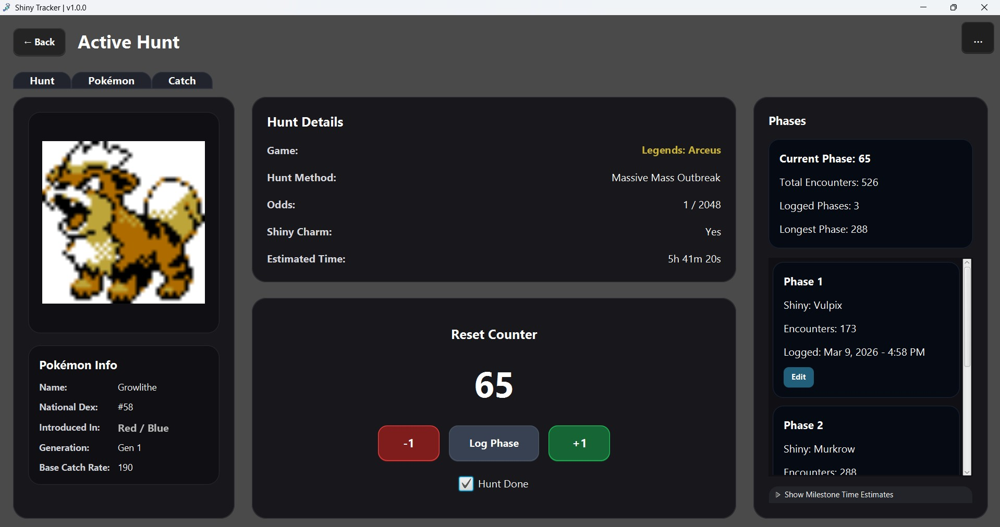
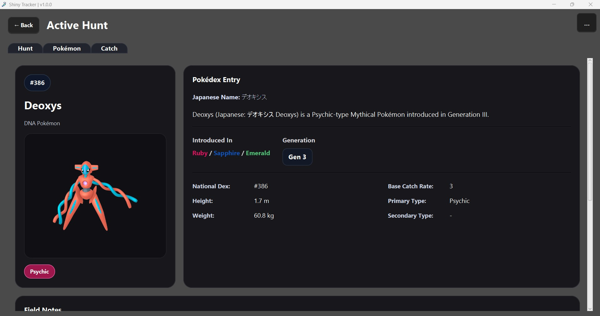
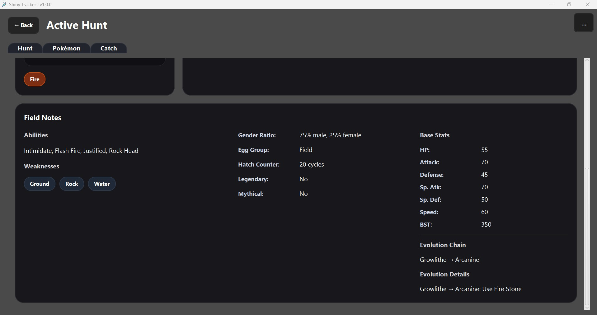
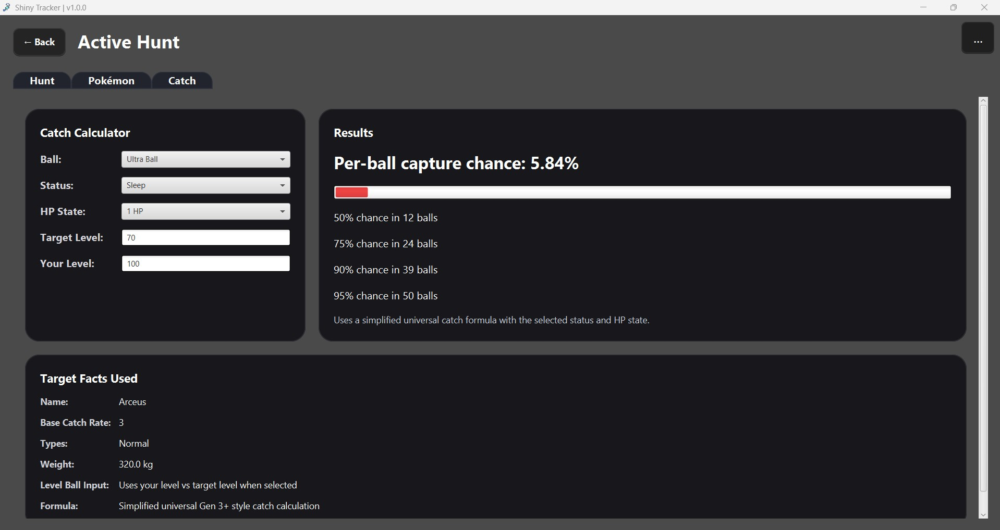

<div align="center">

# Shiny Tracker

A desktop app for tracking Pokémon shiny hunts, phases, probability milestones, and more.

<br>

[](https://github.com/omueller5/shiny-tracker/releases/latest)

[](https://github.com/users/omueller5/projects/2)


⭐ If you find this tool useful, consider **starring the repository** to help others discover it.

</div>

---

## Overview

Shiny Tracker is a lightweight desktop application built for managing Pokémon shiny hunts and related information in one place.

It allows you to track encounters, log phases, explore a built-in Pokédex, calculate catch probabilities, and manage multiple hunts through a clean desktop interface.

All hunt data is stored locally and can be exported or imported as JSON for backups.

---

## Screenshots

| Dashboard | Active Hunt |
|-----------|-------------|
|  |  |

| Probability Milestones | Phase Logging |
|------------------------|---------------|
|  |  |

| Pokédex Entry | Pokédex Field Notes |
|---------------|---------------------|
|  |  |

| Catch Calculator |
|------------------|
|  |

---

## Features

- Multiple active hunts
- Encounter counter
- Phase tracking
- Editable phase shiny entries
- Probability milestone estimates
- Built-in National Pokédex browser
- Catch probability calculator
- Support for multiple games and hunt methods
- Import / export hunt data
- Selection mode for bulk actions
- Built-in Help page

---

## Download

Download the latest build from the **Releases** page.

### How to Run

1. Download `ShinyTracker-Windows.zip`
2. Extract the zip
3. Open the extracted folder
4. Run:

```text
Shiny Tracker.exe
```


No installation required.

---

## Data & Backups

All hunt data is stored locally on your machine.

You can export hunts at any time to create backups or move hunts between computers.

---

## Notes

This project is an independent fan-made tool and is not affiliated with Nintendo, Game Freak, or The Pokémon Company.

---

## Author

Created by **Owen**
